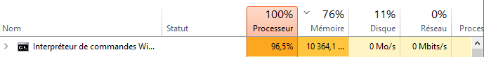
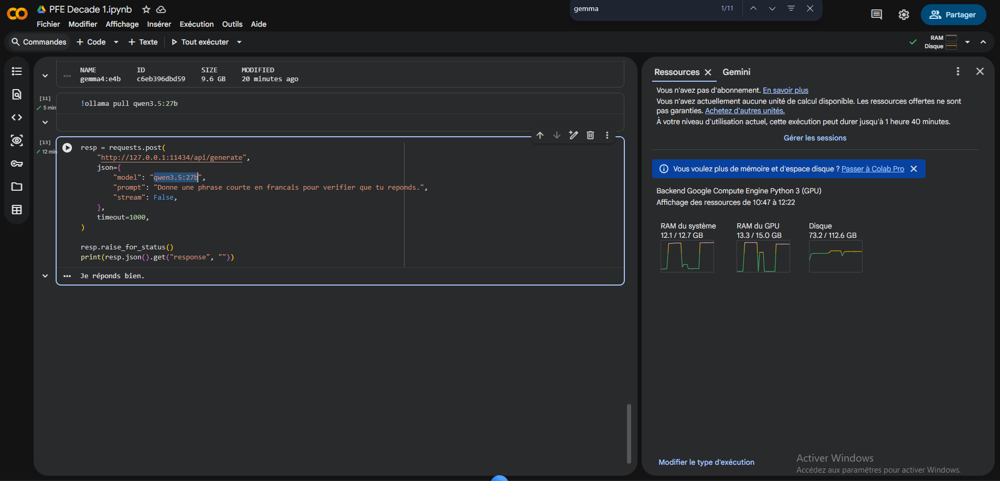
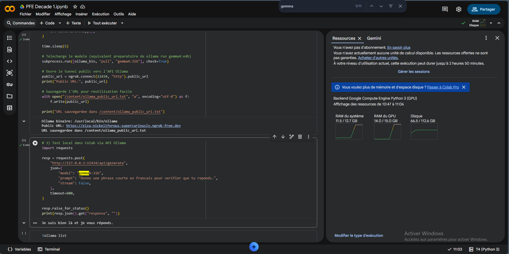

# Exploration des LLMs Multimodaux Gratuits

# Test Ollama (local)/ APIs de la plateform OpenRouter /Groq

## 📋 Tableau comparatif

| Modèle | Fournisseur | Plateforme | Input :1 image | Input :Texte seul(sans image) | Input :Multi-images | Input :Images + Métadonnées | Limite |  |
| --- | --- | --- | --- | --- | --- | --- | --- | --- |
| Gemma 4 | Google | Ollama (local) | ⚠️ (Très lent : il génère une réponse acceptable, mais seulement après 6 minutes. ) | ⚠️ (Lent : 2 minutes pour répondre à une simple question. ) | ❌ La machine se plaint temporairement. | ❌ | 🔴 Machine insuffisante |  |
| Qwen-VL | Alibaba | Ollama (local) | ⚠️ (Très lent : il génère une réponse acceptable, mais seulement après 6 minutes. | ⚠️ (lent : 2 min) | ❌ La machine se plaint temporairement. | ❌ | 🔴 Machine insuffisante |  |
| Moondream | Open source | Ollama (local) | ⚠️ (Très lent : il génère une réponse médiocre, mais seulement après 5 minutes.) | ⚠️ (très lent 3 min) | ❌ La machine se plaint temporairement. | ❌ | 🔴 Machine insuffisante |  |
| Gemma 4 | Google | OpenRouter | ✅ il repond bien | ✅ il repond bien | ❌ | ❌ | 🟡 Context overflow |  |
| **Nemotron Nano 12B 2 VL** | **NVIDIA** | **OpenRouter** | ✅ réponse acceptable (n’est pas tres riche) | ✅ il repond bien | **✅ il genere une reponse mais il hallucine un peu** | **❌** | **🟡** Context overflow |  |
| Qwen 3.6 Plus | Alibaba | OpenRouter | ❌ il se crash | ✅ il repond bien | ❌ | ❌ | 🔴 HTTP 429 (To Many Requests) dès le 1er appel |  |
| LLaMA 3.3 70B Versatile | Meta / Groq | Groq | ✅ il repond bien | ✅ il repond bien | ❌ | ❌ | 🔴 tokens > quota 12k TPM |  |
| Groq Compound | Groq | Groq | ✅ il repond bien | ✅ il repond bien | ❌ | ❌ | 🔴 Limite TPM ×3,8 dépassée |  |

**Légende :** ✅ Succès · ⚠️ Partiel / lent · ❌ Échec (overflow / quota / crash)

---

## 1. Exécution locale — Ollama

> Ollama est un outil open source permettant d'exécuter des LLMs directement en local, sans API externe. Avantages : confidentialité des données, absence de quota de requêtes.
> 

### Verdict 🔴 Non viable

L'exécution locale de modèles multimodaux requiert un **GPU dédié** . En l'absence de GPU :

- Le traitement repose entièrement sur le **CPU** → temps d'inférence prohibitifs
- Les images encodées en **base64** génèrent un volume de tokens très élevé → saturation de la RAM → plantages

Exemple avec Gemma sur une image:




---

## 2. APIs gratuites — OpenRouter

> OpenRouter est une plateforme d'agrégation d'APIs permettant d'accéder à de nombreux modèles via une interface unifiée. Certains modèles sont disponibles gratuitement avec des quotas limités sur la taille du contexte et le débit de requêtes.
> 

### Résultats par modèle

**Gemma 4** (Google · Free tier)

- 1 image : ✅ | Texte : ✅ | Multi-images : ❌ context overflow | Images + Métadonnées : ❌ context overflow

**Nemotron Nano 12B 2 VL** (NVIDIA · Free tier)

- 1 image : ✅ | Texte : ✅ | Multi-images : ✅ | Images + Métadonnées : ❌ context overflow

**Qwen 3.6 Plus** (Alibaba · Free tier)

- 1 image : ❌ crash | Texte : ✅ | Multi-images : ❌ | Images + Métadonnées : ❌

### Verdict 🟡 Partiellement viable, non robuste

Les modèles du tier gratuit imposent une **fenêtre de contexte réduite**. Le cas d'usage complet (plusieurs images + attributs textuels + descriptif) dépasse systématiquement les limites allouées. Qwen 3.6 Plus a également rencontré des **erreurs HTTP 429** dès les premiers appels (saturation upstream Alibaba côté OpenRouter).

Exemple de Gemma4 avec plusieur images 


---

## 3. APIs gratuites — Groq

> Groq est une plateforme d'inférence ultra-rapide basée sur des puces **LPU (Language Processing Unit)** propriétaires. Le tier gratuit impose des quotas stricts sur le nombre de **tokens par minute (TPM)**.
> 

### Résultats

| Limite gratuite | Input d'un produit (minimum de metadata) | Dépassement |
| --- | --- | --- |
| **12 000 tokens / minute** | 46 214 tokens reçus | **×3,8 au-delà du quota** |

**Erreur retournée — HTTP 413 :**

```
Error 413: Request Too Large for model 'llama-3.3-70b-versatile'
Limit 12,000 TPM | Requested 46,214 tokens
→ rate_limit_exceeded
```

### Verdict 🔴 Non viable

Même un seul produit avec ses images et attributs dépasse largement le quota TPM du tier gratuit. Le passage au **Dev Tier payant** (proposé par Groq) serait nécessaire pour toute utilisation en production.

exemple avec plusieur images:


---

# Test avec GPU gratuit de Google Colab (modeles puissants)

**Test du modèle Qwen3.5 (27B)**

- **Temps de réponse lent :** Pour générer une simple phrase de vérification (« Je réponds bien. »), la cellule a mis **12 minutes** à s'exécuter, ce qui indique une énorme latence pour l'inférence.
- **Consommation GPU :** Le graphique des ressources à droite montre que le modèle sature presque l'environnement. La mémoire vidéo (RAM du GPU) atteint une consommation totale de **13,3 Go sur les 15,0 Go** disponibles, laissant très peu de marge de manœuvre.




**Test du modèle Gemma (31B)**

- **Temps de réponse lent :** Bien qu'il soit plus rapide que le modèle précédent, il faut tout de même attendre **5 minutes** pour obtenir une phrase basique en retour.
- **Consommation GPU :** La charge sur le processeur graphique est encore plus critique ici. La RAM du GPU culmine à **14,0 Go sur 15,0 Go**, ce qui frôle la limite absolue d'erreur de mémoire (Out Of Memory) autorisée par la session Google Colab. De plus, la RAM du système classique monte également en flèche (11,5 Go).



---

Test avec Google AI Studio (le meilleur pour les essais gratuits).

### 📊 Tableau Analytique Comparatif

*Analyse d'un produit (Blouse bébé Jacadi) basée sur 4 images et métadonnées.*

| Critère d'évaluation | 🟢 Gemini 2.5 Flash | 🟠 Gemma 4 31B IT |
| --- | --- | --- |
| **Fiabilité (Contradictions)** | ✅ Aucune erreur (0/1) | ❌ Erreur critique (1/1) - *Confusion avant/dos* |
| **Attributs manquants détectés** | ✅ Exhaustif (15/15) | ⚠️ Incomplet (9/15) |
| **Nouveaux attributs générés** | ❌ Aucun (0) | ❌ Aucun (0) |
| **Cohérence linguistique** | ⚠️ Répond en Anglais | ✅ Répond en Français |
| **Analyse visuelle (Images)** | ✅ Bonne compréhension | ❌ Mauvaise interprétation spatiale |
| **Précision des couleurs** | ⚠️ Incomplet (3/5 détectées) | ⚠️ Incomplet (3/5 détectées) |

> **Verdict Modèles :** **Gemini 2.5 Flash** est nettement plus fiable et exhaustif, bien qu'il faille gérer la traduction de ses outputs. **Gemma 4 31B** présente des hallucinations critiques sur la lecture des images qui le rendent dangereux pour l'automatisation e-commerce.
> 

### 🧱 Limites d'utilisation de Google AI Studio (Version Gratuite)

L'exploitation des modèles multimodaux (comme Gemini 2.5 Flash) via le *Free Tier* de Google AI Studio pour de l'analyse e-commerce (Texte + Multi-images) se heurte à des restrictions strictes qui empêchent le flow :

- **Explosion des Quotas de Tokens (TPM - Tokens Per Minute) :** L'analyse d'une seule fiche produit contenant plusieurs images HD (ex: 4 vues d'un vêtement) consomme un volume massif de tokens. Ce volume dépasse quasi systématiquement les limites TPM restreintes de l'offre gratuite.
- **Blocage par Rate Limits (RPM - Requests Per Minute) :** La version gratuite impose une limite stricte de requêtes par minute et par jour. Dès que l'on tente d'analyser quelques produits à la suite, l'API bloque l'accès et retourne des erreurs `HTTP 429 : Too Many Requests`.
- **Saturation du Contexte (Context Overflow) :** L'association d'un prompt complexe, d'attributs existants (JSON/Texte) et de plusieurs images peut saturer la fenêtre de contexte allouée aux comptes gratuits, provoquant l'échec de la requête.
- **Absence de garantie de service :** Sur le plan gratuit, les requêtes sont traitées avec une priorité basse, ce qui peut entraîner des temps de latence variables ou des échecs de génération lors des pics d'utilisation mondiaux.